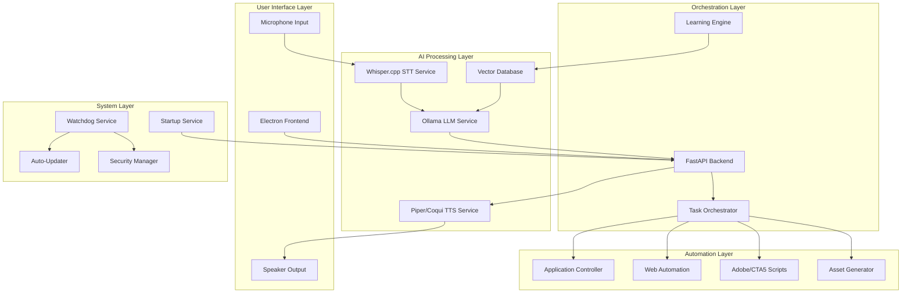

# AI Assistant Desktop Application - Design Document

## Overview

The AI Assistant Desktop Application is architected as a multi-layered system combining a Python FastAPI backend for AI processing and automation, an Electron frontend for user interaction, and various specialized services for speech processing, application control, and system integration. The design emphasizes modularity, security, cross-platform compatibility, and autonomous operation.

## Architecture

### High-Level Architecture

The system follows a microservices-inspired architecture with clear separation of concerns:



### Core Design Principles

1. **Modularity**: Each component is independently deployable and testable
2. **Security-First**: All data encrypted, sandboxed execution, permission-based access
3. **Autonomous Operation**: Self-healing, auto-updates, proactive assistance
4. **Cross-Platform**: Consistent behavior across Windows, macOS, and Linux
5. **Local-First**: All processing happens locally with optional web research
6. **Extensibility**: Plugin architecture for adding new automation capabilities

## Components and Interfaces

### 1. Frontend Layer (Electron Application)

**Technology Stack**: Electron, React, TypeScript, Tailwind CSS

**Key Components**:
- **Main Window**: Chat interface with voice/text input
- **Tray Application**: Always-accessible system tray icon
- **Settings Panel**: Configuration and preferences
- **Demo Mode**: Interactive onboarding experience

**Interfaces**:
```typescript
interface ChatMessage {
  id: string;
  type: 'user' | 'assistant';
  content: string;
  timestamp: Date;
  audioUrl?: string;
}

interface VoiceInput {
  startRecording(): Promise<void>;
  stopRecording(): Promise<Blob>;
  isRecording: boolean;
}

interface BackendAPI {
  sendMessage(message: string): Promise<ChatMessage>;
  sendVoice(audioBlob: Blob): Promise<ChatMessage>;
  getSystemStatus(): Promise<SystemStatus>;
}
```

### 2. AI Processing Services

#### Whisper.cpp STT Service
**Purpose**: Convert speech to text with high accuracy
**Implementation**: 
- Standalone service wrapping whisper.cpp
- WebSocket connection for real-time streaming
- Multiple model sizes (tiny, base, small, medium, large)
- Language detection and multilingual support

#### Ollama LLM Service
**Purpose**: Core reasoning and command interpretation
**Implementation**:
- Local Ollama server with selected models (Llama 3.1, Mistral, etc.)
- REST API integration
- Context management for conversation history
- Function calling for tool integration

#### TTS Service (Piper/Coqui)
**Purpose**: Natural voice synthesis
**Implementation**:
- Multiple voice models for personality options
- SSML support for expressive speech
- Real-time streaming for responsive interaction
- Voice cloning capabilities (optional)

### 3. Backend Orchestration (FastAPI)

**Core API Endpoints**:
```python
@app.post("/chat/message")
async def process_message(message: ChatRequest) -> ChatResponse

@app.post("/chat/voice")
async def process_voice(audio: UploadFile) -> ChatResponse

@app.get("/system/status")
async def get_system_status() -> SystemStatus

@app.post("/automation/execute")
async def execute_automation(task: AutomationTask) -> TaskResult
```

**Key Services**:
- **Command Parser**: Interprets user intents from LLM output
- **Task Orchestrator**: Manages complex multi-step workflows
- **Context Manager**: Maintains conversation and user state
- **Security Manager**: Handles permissions and sandboxing

### 4. Automation Layer

#### Application Controller
**Technology**: PyAutoGUI, Windows API, AppleScript, X11
**Capabilities**:
- Window management and focus control
- Keyboard and mouse automation
- Screenshot analysis for GUI state detection
- Application-specific integrations

#### Web Automation Engine
**Technology**: Playwright
**Capabilities**:
- Multi-browser support (Chrome, Firefox, Safari, Edge)
- JavaScript execution in web contexts
- Form filling and data extraction
- File downloads and uploads

#### Creative Automation Scripts
**Adobe Animate (JSFL)**:
```javascript
// Example JSFL automation structure
function createAnimatedScene(sceneData) {
    var doc = fl.createDocument();
    // Animation creation logic
    return doc.exportSWF(outputPath);
}
```

**Cartoon Animator 5**:
- Python API integration
- Character rigging automation
- Scene composition scripts
- Render pipeline automation

### 5. Asset Generation System

#### Image Generation (Stable Diffusion/Flux)
**Implementation**:
- Local model hosting with optimized inference
- Prompt engineering for consistent results
- Style transfer and image editing capabilities
- Integration with automation workflows

#### Video Processing
**Technology**: FFmpeg, OpenCV
**Capabilities**:
- Video composition and editing
- Audio synchronization
- Format conversion and optimization
- Thumbnail generation

## Data Models

### User Profile and Learning Data
```python
class UserProfile:
    user_id: str
    preferences: Dict[str, Any]
    workflow_patterns: List[WorkflowPattern]
    custom_automations: List[CustomAutomation]
    learning_data: EncryptedData
    created_at: datetime
    updated_at: datetime

class WorkflowPattern:
    pattern_id: str
    application: str
    actions: List[UserAction]
    frequency: int
    last_detected: datetime
    automation_suggested: bool
```

### Task and Automation Models
```python
class AutomationTask:
    task_id: str
    user_command: str
    parsed_intent: Intent
    execution_steps: List[ExecutionStep]
    status: TaskStatus
    result: Optional[TaskResult]
    created_at: datetime

class ExecutionStep:
    step_id: str
    step_type: StepType  # APP_CONTROL, WEB_AUTOMATION, ASSET_GENERATION
    parameters: Dict[str, Any]
    dependencies: List[str]
    status: StepStatus
```

### System Configuration
```python
class SystemConfig:
    ai_models: ModelConfig
    automation_settings: AutomationConfig
    security_settings: SecurityConfig
    startup_settings: StartupConfig
    update_settings: UpdateConfig

class ModelConfig:
    llm_model: str
    stt_model: str
    tts_voice: str
    image_model: Optional[str]
```

## Error Handling

### Self-Healing Architecture

**Watchdog Service**: Monitors all components and triggers repairs
```python
class WatchdogService:
    async def monitor_components(self):
        # Check component health
        # Detect failures and anomalies
        # Trigger appropriate repair actions
        
    async def repair_component(self, component: str, error: Exception):
        # Execute component-specific repair scripts
        # Reinstall dependencies if needed
        # Restart services
        # Log repair actions
```

**Error Categories and Responses**:
1. **Component Failures**: Auto-restart, dependency reinstall
2. **Model Loading Issues**: Model re-download, fallback models
3. **Automation Failures**: Retry with different strategies, user notification
4. **Network Issues**: Offline mode activation, cached responses
5. **Permission Errors**: User prompt for elevated access

### Graceful Degradation
- **No Internet**: Full offline operation with cached knowledge
- **Limited Resources**: Automatic model downsizing
- **Component Failures**: Fallback to alternative implementations
- **Security Restrictions**: Reduced functionality with user notification

## Testing Strategy

### Unit Testing
- **AI Services**: Mock model responses, test parsing logic
- **Automation**: Simulated application states, controlled environments
- **Security**: Penetration testing, encryption validation
- **Cross-Platform**: Automated testing on all target platforms

### Integration Testing
- **End-to-End Workflows**: Complete user scenarios from voice to result
- **Component Communication**: API contract testing, message validation
- **Performance Testing**: Load testing, memory usage monitoring
- **Upgrade Testing**: Version migration, backward compatibility

### User Acceptance Testing
- **Demo Mode Validation**: Ensure all demonstrations work correctly
- **Real-World Scenarios**: Test with actual user workflows
- **Accessibility Testing**: Screen reader compatibility, keyboard navigation
- **Security Auditing**: Third-party security assessment

## Security Architecture

### Data Protection
- **Encryption at Rest**: AES-256 for all local storage
- **Encryption in Transit**: TLS 1.3 for all network communication
- **Key Management**: Hardware security module integration where available
- **Data Isolation**: Separate encryption keys per user profile

### Sandboxing and Permissions
```python
class SecurityManager:
    def execute_sandboxed(self, script: str, permissions: List[Permission]):
        # Create isolated execution environment
        # Apply permission restrictions
        # Monitor resource usage
        # Clean up after execution
        
    def request_permission(self, action: str, resource: str) -> bool:
        # Check existing permissions
        # Prompt user if needed
        # Log permission grants/denials
```

### Tamper Detection
- **Binary Integrity**: Code signing and hash verification
- **Runtime Protection**: Anti-debugging, anti-tampering measures
- **Audit Logging**: Comprehensive security event logging
- **Automatic Recovery**: Restore from known-good backups

## Deployment and Installation

### Installer Architecture
**Windows (Inno Setup)**:
- System requirement validation
- Dependency installation (Python runtime, models)
- Service registration
- Registry configuration for auto-start

**macOS (PKG/DMG)**:
- Notarization for security compliance
- LaunchAgent configuration
- Keychain integration for secure storage

**Linux (AppImage/DEB)**:
- Systemd service configuration
- Desktop integration
- Package manager compatibility

### Auto-Update System
```python
class UpdateManager:
    async def check_for_updates(self) -> Optional[UpdateInfo]:
        # Check version manifest
        # Validate signatures
        # Return update information
        
    async def download_and_apply_update(self, update: UpdateInfo):
        # Download update package
        # Verify integrity
        # Apply update with rollback capability
        # Restart services
```

### Startup Integration
- **Windows**: Task Scheduler + Registry entries
- **macOS**: LaunchAgent with KeepAlive
- **Linux**: Systemd user service with auto-restart

This design provides a robust, secure, and scalable foundation for your AI Assistant Desktop Application, addressing all requirements while maintaining flexibility for future enhancements.