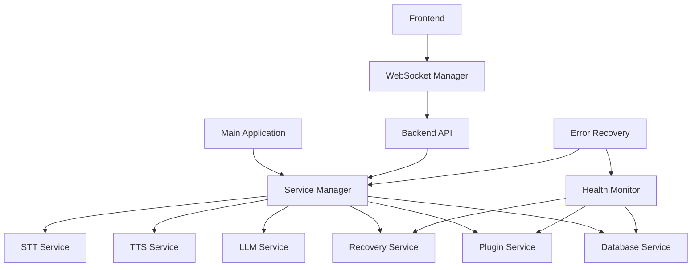
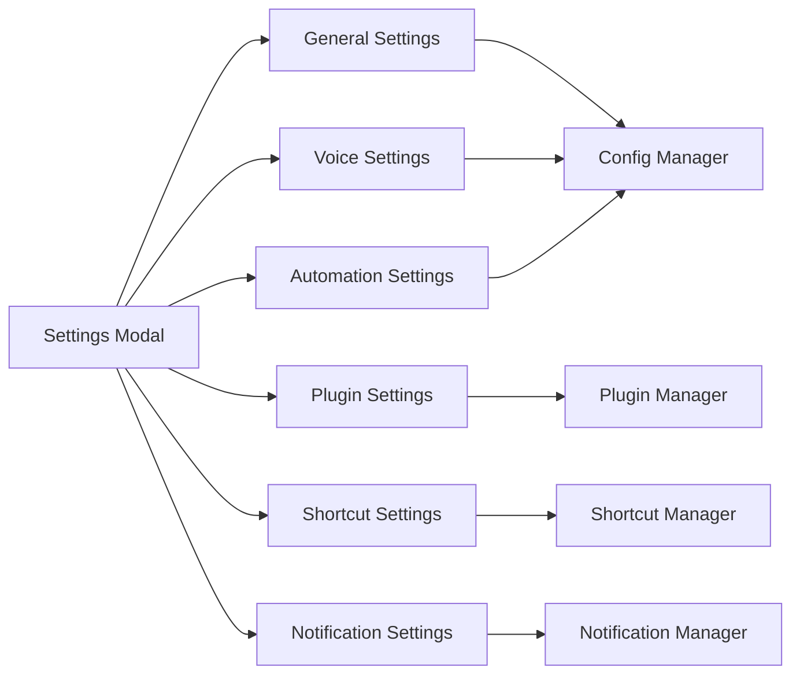

# Design Document

## Overview

This design document outlines the completion of remaining missing features in the AI Assistant Desktop Application. The focus is on integrating existing services, completing the settings interface, creating missing icon assets, ensuring robust frontend-backend communication, and achieving production readiness.

## Architecture

### Service Integration Architecture



### Settings Interface Architecture



## Components and Interfaces

### 1. Service Integration Manager

**Purpose:** Coordinate all backend services and ensure proper initialization and communication.

**Key Methods:**
- `initializeServices()`: Start all services in proper order
- `registerService(name, service)`: Register service with manager
- `getServiceStatus()`: Get status of all services
- `restartService(name)`: Restart a specific service

**Integration Points:**
- Database Service for persistent storage
- Plugin Service for extensibility
- Recovery Service for error handling
- All AI services (LLM, TTS, STT)

### 2. Enhanced Settings Interface

**Purpose:** Provide comprehensive configuration interface for all application features.

**Components:**
- `SettingsModal`: Main settings container
- `GeneralSettings`: Basic app preferences
- `VoiceSettings`: TTS/STT configuration
- `AutomationSettings`: Automation preferences and safety
- `PluginSettings`: Plugin management interface
- `ShortcutSettings`: Global shortcut configuration
- `NotificationSettings`: Notification preferences

**State Management:**
- Real-time validation of settings
- Immediate application of changes
- Persistent storage of preferences

### 3. Icon Asset System

**Purpose:** Provide comprehensive visual feedback through system tray and application icons.

**Icon Types:**
- Application icons (16x16 to 512x512)
- Tray icons with status indicators
- Notification icons
- Plugin icons

**Status Indicators:**
- Idle: Default blue icon
- Listening: Microphone indicator
- Processing: Animated processing indicator
- Error: Red error indicator
- Offline: Grayed out icon

### 4. WebSocket Communication Layer

**Purpose:** Ensure reliable real-time communication between frontend and backend.

**Features:**
- Automatic reconnection on connection loss
- Message queuing during disconnection
- Heartbeat monitoring
- Error propagation and handling

**Message Types:**
- Service status updates
- User action requests
- Error notifications
- Configuration changes

## Data Models

### Service Status Model
```typescript
interface ServiceStatus {
  name: string;
  status: 'healthy' | 'degraded' | 'offline';
  lastCheck: Date;
  error?: string;
  details?: Record<string, any>;
}
```

### Settings Model
```typescript
interface AppSettings {
  general: {
    theme: 'light' | 'dark' | 'auto';
    language: string;
    startOnBoot: boolean;
    minimizeToTray: boolean;
  };
  voice: {
    ttsEnabled: boolean;
    ttsVoice: string;
    ttsSpeed: number;
    sttEnabled: boolean;
    sttLanguage: string;
    voiceActivation: boolean;
  };
  automation: {
    enabled: boolean;
    confirmActions: boolean;
    safetyMode: boolean;
    allowedApplications: string[];
  };
  notifications: {
    enabled: boolean;
    showTaskComplete: boolean;
    showErrors: boolean;
    soundEnabled: boolean;
  };
  shortcuts: Record<string, string>;
  plugins: Record<string, PluginConfig>;
}
```

### Icon Asset Model
```typescript
interface IconAsset {
  name: string;
  sizes: number[];
  formats: ('png' | 'ico' | 'icns')[];
  variants: ('default' | 'listening' | 'processing' | 'error')[];
}
```

## Error Handling

### Service Integration Errors
- Service initialization failures
- Inter-service communication errors
- Configuration loading errors
- Database connection issues

**Recovery Strategy:**
- Automatic service restart
- Fallback to degraded mode
- User notification of critical failures
- Detailed error logging

### Frontend-Backend Communication Errors
- WebSocket connection failures
- Message delivery failures
- Timeout errors
- Protocol errors

**Recovery Strategy:**
- Automatic reconnection with exponential backoff
- Message queuing and replay
- Graceful degradation of features
- User feedback on connection status

## Testing Strategy

### Integration Testing
- Service startup and shutdown sequences
- Inter-service communication
- Error recovery scenarios
- Configuration persistence

### UI Testing
- Settings interface functionality
- Real-time setting updates
- Validation and error handling
- Accessibility compliance

### Asset Testing
- Icon rendering at different sizes
- Tray icon status updates
- Cross-platform icon compatibility
- High DPI support

### Communication Testing
- WebSocket connection reliability
- Message delivery guarantees
- Error propagation
- Performance under load

## Implementation Phases

### Phase 1: Service Integration
1. Create Service Manager
2. Update main.py to use Service Manager
3. Implement service registration and monitoring
4. Add inter-service communication

### Phase 2: Settings Interface
1. Complete SettingsModal component
2. Implement all settings categories
3. Add real-time validation and updates
4. Integrate with backend configuration

### Phase 3: Icon Assets
1. Generate missing tray icon variants
2. Create high-resolution application icons
3. Implement dynamic tray icon updates
4. Test cross-platform compatibility

### Phase 4: Communication Layer
1. Enhance WebSocket implementation
2. Add message queuing and reliability
3. Implement heartbeat monitoring
4. Add error recovery mechanisms

### Phase 5: Production Readiness
1. Comprehensive error handling
2. Performance optimization
3. Memory leak prevention
4. Final testing and validation